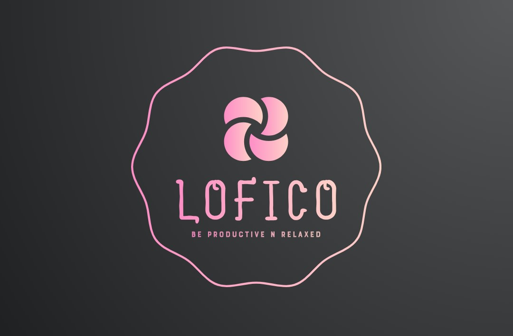

# LofiCo



This is a web application that combines a lofi music player with a task manager. Users can listen to their favorite lofi playlists while managing their tasks in one place, to increase their productivity.

## Features

- **Lofi Music Player:** Enjoy a collection of relaxing lofi music tracks while working or studying.
- **Task Manager:** Keep track of your tasks and to-dos with a simple and intuitive interface.
- **Responsive Design:** The application is designed to work seamlessly across different devices and screen sizes.
- **React Frontend:** The frontend is built using React, providing a modern and interactive user interface.
- **Express Backend:** The backend is powered by Express, providing a robust and efficient server-side architecture.


## Getting Started

To get started with the application, follow these steps:

1. Clone the repository:

```bash
‎ 
git clone https://github.com/mohit-nagaraj/lofico.git
‎ 
```

2. Install dependencies:

```bash
‎ 
cd lofi-music-player-and-task-manager
npm install
‎ 
```

Start the development server:
```bash
‎ 
npm start
‎
```

Open your browser and navigate to http://localhost:3000 to view the application.

## Contributing
Contributions are welcome! If you'd like to contribute to this project, please follow these guidelines:

* Fork the repository and create a new branch for your feature or bug fix.
* Make your changes and test them thoroughly.
* Submit a pull request with a clear description of your changes.

# License
This project is licensed under the MIT License - see the LICENSE file for details.

Acknowledgements<br>
Thanks to Lofi Hip Hop Radio for providing the awesome lofi music tracks used in this application.
